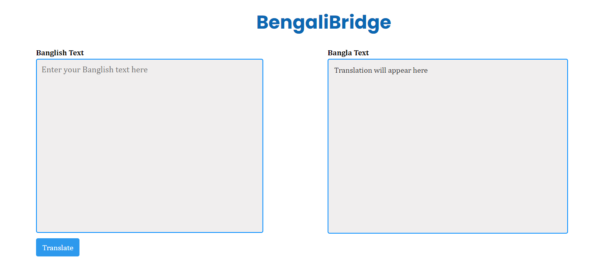
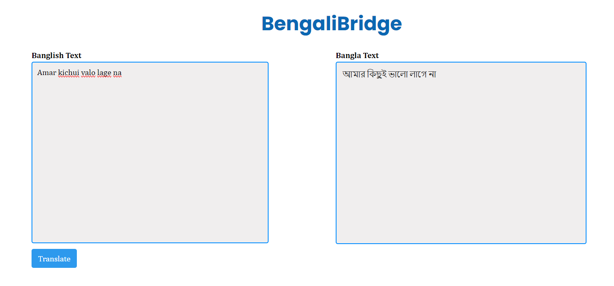

# Banglish to Bangla Machine Translation API using FastAPI

This is a simple API built with FastAPI for translating Banglish (Bangla written in Roman script) to Bangla script.

## Description

This API takes Banglish text as input and returns the translated Bangla text. It's useful for scenarios where users are more comfortable typing in Roman script but require the text to be translated into Bangla script.

## Dataset Used

The Banglish to Bangla Machine Translation App utilizes the [Vashantor dataset](https://data.mendeley.com/datasets/bj5jgk878b/2) for training and evaluation.

## Features

- Translate Banglish text to Bangla script
- FastAPI backend for efficient performance
- Simple and easy-to-use API endpoints

## Screenshots

### Before Translation


### After Translation


## Usage

1. Clone the repository:
    ```bash
    git clone https://github.com/yourusername/Banglish-to-Bangla-Machine-Translation-API-using-FastAPI.git
    ```

2. Install dependencies:
    ```bash
    pip install -r requirements.txt
    ```

3. Run the server:
    ```bash
    uvicorn main:app --reload
    ```


## API Documentation

You can access the Swagger UI documentation for the API at `http://localhost:8000/docs` after running the server.

## Contributing

Contributions are welcome! If you'd like to contribute to the project, please fork the repository and submit a pull request with your changes.


